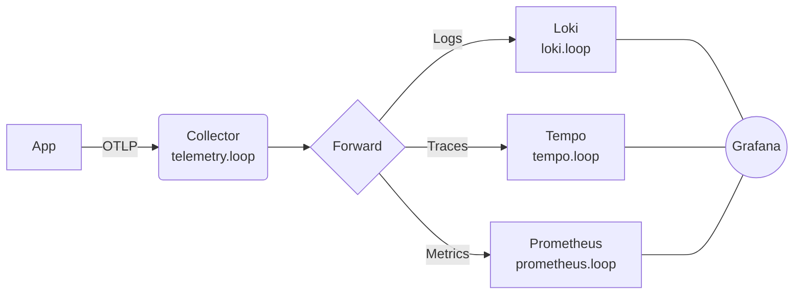
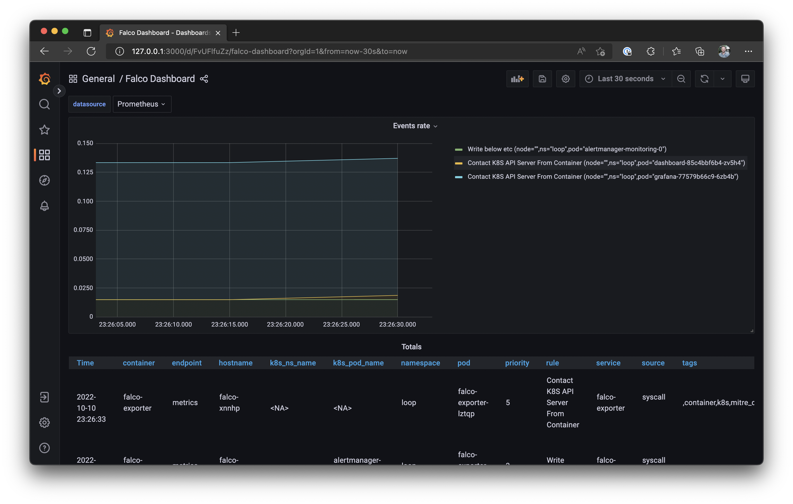

# devkube

devkube bootstraps feature-rich Kubernetes clusters locally using Docker or on a specified cloud provider on top of their managed Kubernetes offering.

## Batteries included

- [Registry](https://github.com/distribution/distribution) - image distribution
- [Dashboard](https://kubernetes.io/docs/tasks/access-application-cluster/web-ui-dashboard/) - web-based user interface
- [Cert-Manager](https://cert-manager.io)- certificate management
- [Ingress](https://kubernetes.github.io/ingress-nginx/) - NGINX Ingress Controller
- [Grafana](https://grafana.com/grafana/) - data observability
- [Prometheus](https://prometheus-operator.dev) - monitoring system
- [Loki](https://grafana.com/oss/loki/) - log aggregation system
- [Tempo](https://grafana.com/oss/tempo/) - distributed tracing backend

### Optional Add-ons

- [Linkerd](https://linkerd.io) - Service Mesh
- [Falco](https://falco.org) - Kubernetes threat detection engine
- [Trivy](https://aquasecurity.github.io/trivy-operator/latest/) - Kubernetse workload vulnerability scanning

### Cloud providers

- [AWS (Alpha)](https://aws.amazon.com/eks/)
- [Azure (Beta)](https://azure.microsoft.com/en-us/services/kubernetes-service/)
- [DigitalOcean (Alpha)](https://www.digitalocean.com/products/kubernetes)
- [Linode (Alpha)](https://www.linode.com/products/kubernetes/)
- [Vultr (Alpha)](https://www.vultr.com/kubernetes/)


## Install

#### MacOS / Linux

[Homebrew](https://brew.sh)

```
brew install adrianliechti/tap/devkube
```

#### Windows

[Scoop](https://scoop.sh)

```shell
scoop bucket add adrianliechti https://github.com/adrianliechti/scoop-bucket
scoop install kubectl helm adrianliechti/devkube
```

## Create Cluster

```shell
devkube create
```


## Access Dashboard

```shell
devkube dashboard
```


> Press "Skip" on the login page to access the dashboard as admin

## Access Grafana

```shell
devkube grafana
```


## Advanced Features

### Ingress Controller


```shell
devkube trust
devkube ingress
```

### OpenTelemetry




### Trivy

Trivy is a comprehensive security scanner. It is reliable, fast, extremely easy to use, and it works wherever you need it.

```shell
devkube enable trivy
```


#### Falco

The Falco Project is a cloud native runtime security tool. Falco makes it easy to consume kernel events, and enrich those events with information from Kubernetes and the rest of the cloud native stack.

```shell
devkube enable falco
```


